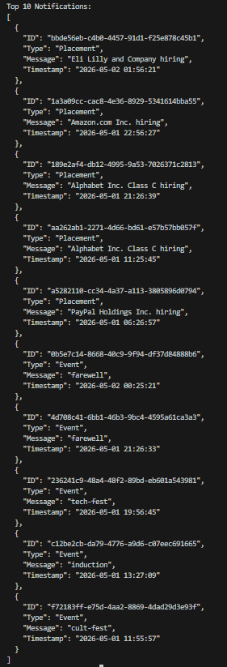

# Notification Dashboard

## Overview

This project fetches notifications from a protected API and displays them in a React dashboard. Notifications are sorted by **type priority** and **recency**, with support for filtering, top-N selection, and pagination.

---

## Problem Statement

Given a stream of notifications from an API, the system must:

* Fetch notifications securely using Bearer token authentication
* Prioritize them by type (Placement > Event > Result)
* Sort by recency within the same type
* Display the top N results with filtering and pagination

---

## Priority Logic

Notifications are ranked using:

1. **Type Priority**
   * Placement (highest)
   * Event
   * Result (lowest)

2. **Recency**
   * Newer notifications rank higher within the same type

---

## Project Structure

```
dashboard/
├── src/
│   ├── components/
│   │   ├── Filters.jsx          # Type filter and Top-N dropdown
│   │   ├── NotificationList.jsx # Renders notification cards
│   │   └── Pagination.jsx       # Prev/Next page navigation
│   ├── api.js                   # Auth, fetch, logging, sort logic
│   ├── App.jsx                  # Main component (state + layout)
│   ├── index.css                # Styling (black & white theme)
│   └── main.jsx                 # React entry point
├── index.js                     # Stage 1: standalone CLI script
├── Notification_System_Design.md
├── screenshots/
├── .env
├── .gitignore
├── index.html
├── vite.config.js
└── package.json
```

---

## Features

* **Sorting** — Placement > Event > Result, then newest first
* **Type Filter** — Filter by All, Placement, Event, or Result
* **Top-N Selector** — Show top 5, 10, or 20 notifications
* **Pagination** — Page-based navigation (5 items per page)
* **Logging** — Logs fetch, filter changes, and pagination to the API
* **Error Handling** — Displays errors if the API call fails

---

## Running the Project

1. Install dependencies:

```bash
npm install
```

2. Start the React dashboard:

```bash
npm run dev
```

3. Run the standalone CLI script (Stage 1):

```bash
node index.js
```

---

## Environment Variables

Create a `.env` file in the dashboard folder:

```env
CLIENT_ID=your_client_id
CLIENT_SECRET=your_client_secret
ACCESS_CODE=your_access_code
```

---

## Logging

Logs are sent to the API with:

* `stack`: frontend
* `level`: info / error
* `package`: api

Logged events:

* Fetch start and completion
* Filter and pagination changes
* Errors during API calls

---

## Output

### CLI (index.js)

Prints the top 10 notifications to the console.



### Dashboard (React)

Displays notifications in a paginated, filterable list.

---

## Key Points

* No database or persistent storage used
* No hardcoded notification data
* Handles API field casing inconsistencies (type/Type, timestamp/Timestamp)
* CORS handled via Vite dev server proxy
* Clean, minimal, submission-ready
